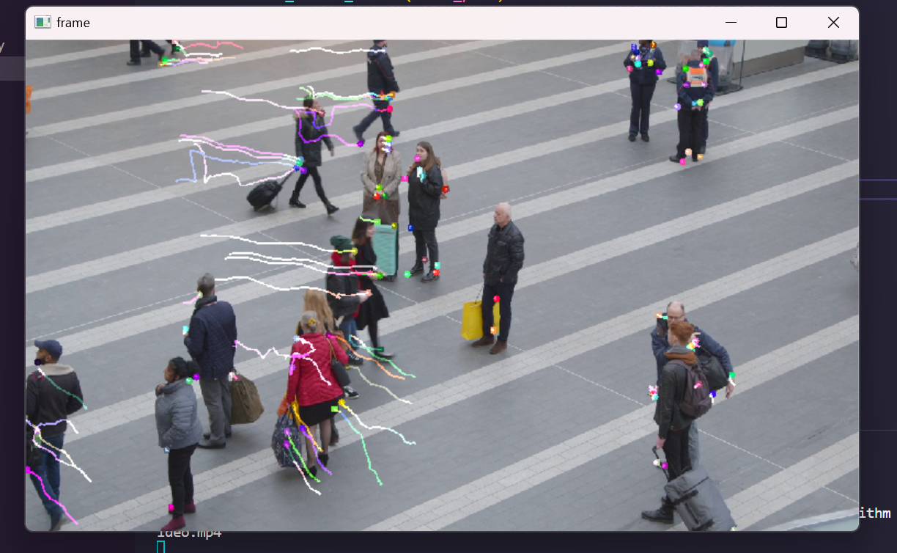
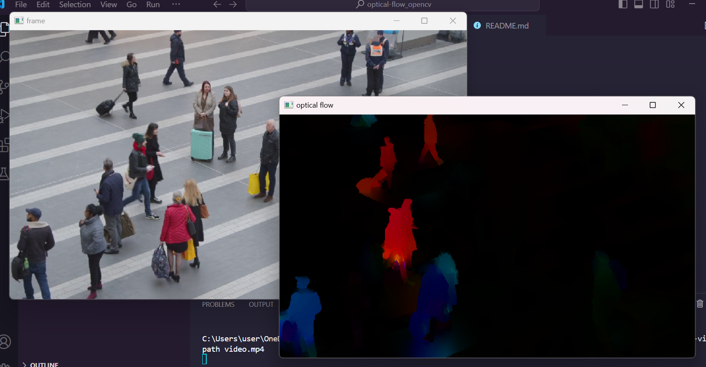
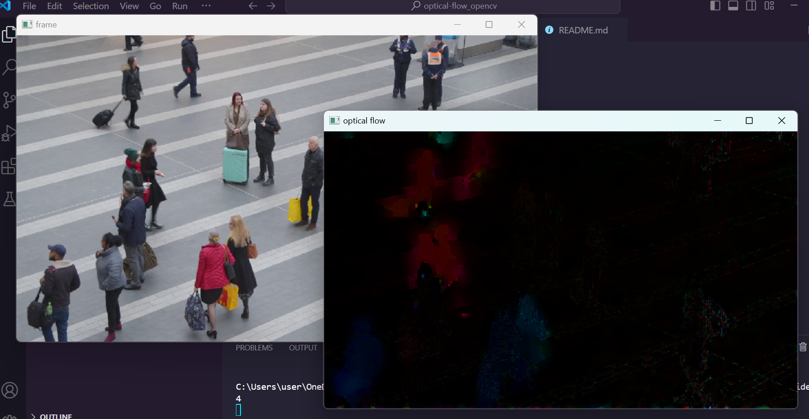

## Optical Flow implementation in OpenCV

Optical flow refers to the process of determining the movement of each pixel between two successive frames in a video. Essentially, it involves computing the vector that represents the change in position of a pixel as an object moves between two adjacent images. The core concept is to measure the shift in position of objects due to their motion or the movement of the camera.


### Sparse Optical Flow

There is a demo `lucas_kanade.py` script of **Lucas-Kanade** algorithm which can be run with this command:

```
py demo.py --algorithm lucaskanade --video_path video.mp4
```



### Dense Optical Flow

The wrapper of Dense Optical Flow algorithms `dense_optical_flow.py` can run a couple of OpenCV's algorithm implementations:

- To start the **Dense Lucas-Kanade** algorithm:
  ```
  py demo.py --algorithm lucaskanade_dense --video_path video.mp4
  ```

  

- To start the **Farneback** algorithm:
  ```
  py demo.py --algorithm farneback --video_path video.mp4
  ```

  

- To start the **RLOF** algorithm:
  ```
  py demo.py --algorithm rlof --video_path video.mp4
  ```

  


